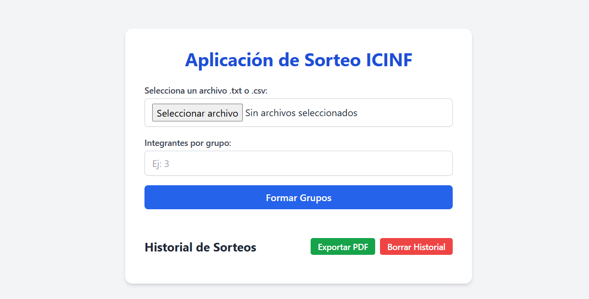

# 🎲 Aplicación de Sorteo / Group Randomizer App



## 📌 Descripción | Description

Esta es una WebApp que permite formar grupos de estudiantes de forma aleatoria a partir de un archivo `.txt` o `.csv`, especificando el número de integrantes por grupo.

This is a WebApp that allows you to randomly create student groups from a `.txt` or `.csv` file, specifying the number of members per group.

## 🚀 Funcionalidades | Features

- 📂 Carga de archivos `.txt` o `.csv`
- 🔢 Definición de número de integrantes por grupo
- 🎯 Generación de grupos aleatorio
- 🕒 Registro de fecha y hora del sorteo
- 💾 Historial persistente con `localStorage`
- 📤 Exportación del historial a **PDF**
- 🗑️ Opción para borrar historial

## 🛠️ Tecnologías Utilizadas | Technologies Used

- HTML5
- JavaScript
- Tailwind CSS
- jsPDF (para exportar PDF)
- Vercel (para despliegue)

## 🌐 Despliegue | Live Demo

Accede a la aplicación aquí:  
🔗 [https://app-sorteo-blond.vercel.app/](https://app-sorteo-blond.vercel.app/)

## 🧑‍💻 Uso | How to Use

1. Clona este repositorio:
   ```bash
   git clone https://github.com/Vikktor93/app-sorteo

## 🔒 Licencia
Este proyecto está bajo la licencia MIT.
